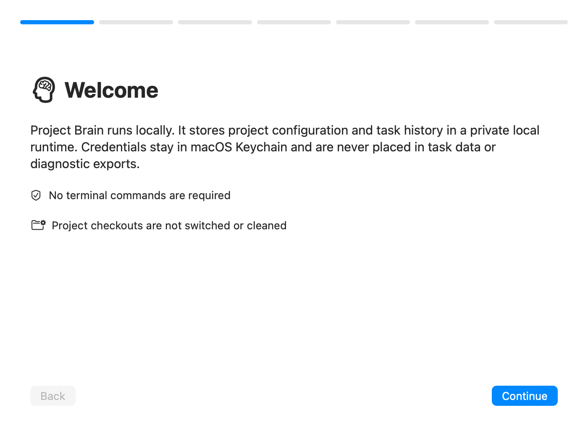

# Project Brain Core MVP

Project Brain Core is a local task control plane. It persists canonical tasks,
runs them in isolated Git worktrees, records independent verification evidence,
and publishes Draft pull requests without automatically accepting or merging
them.

The existing live Gmail Bridge under `experiments/gmail-inbox/` is frozen legacy
behavior and is not part of the Core architecture. This change does not modify,
migrate, launch, or replace it. Project Brain 0.8.0 adds a native macOS menu bar
and management app over the versioned Core configuration and controlled MCP
adapter; it does not copy DevSpace's arbitrary file or terminal authority.

## Product Shell for macOS

`Project Brain.app` is the primary user entry point on macOS 14+. It provides a
seven-step first-run flow, project plan/apply confirmation, Worker and MCP
service management, automatic task/evidence observation, unified readiness,
Keychain-backed managed Tunnel connection, and redacted diagnostic export
without asking the user to run a CLI or maintain Python.

The App can create tasks directly from the menu bar or Task Center. A user
selects a registered project, chooses read-only **Analyze / Review** or
worktree-based **Implement change**, reviews the exact Base SHA and execution
snapshot, and confirms a token-bound plan. ChatGPT is an optional ingress, not
a prerequisite for local tasks; Secure MCP Tunnel and external ChatGPT
acceptance remain separate Pending gates.

The app embeds a self-contained Core helper and can import a user-downloaded,
reviewed Tunnel Client into its private App Support directory. Both installers
use atomic replacement and rollback. Build 8 also binds the App and helper
to one immutable, versioned CLI contract, upgrades a stale same-version helper
by SHA-256, and enforces one user process and one management window. Build 8
adds the strict stdin JSON local-task contract, schema-v9 plan/execution
snapshots, one-time guided first task, and persisted analysis results. Build 4
added an MCP transport-probe
wizard with explicit external-acceptance Pending state. The optional fixed
one-document Draft PR task remains locked because the current Tunnel contract
does not provide trusted ChatGPT control-plane attestation. The unsigned
internal Build 8 artifact, first-run guide, and current
external limits are documented in [`docs/product-shell.md`](docs/product-shell.md)
and [`docs/product-shell-build8-local-task-verification.md`](docs/product-shell-build8-local-task-verification.md).



## Guarantees

- Stable project, task, dedupe, criterion, and verification IDs are validated
  before persistence.
- SQLite is authoritative for registered projects. Every task atomically binds
  the project configuration revision, SHA-256, and full execution profile that
  all retries, recovery, verification, and publication continue to use.
- Mutable runtime data is private and lives outside source under
  `~/.project-brain/` by default.
- Every implementation runs under
  `<runtime>/worktrees/<project-id>/<task-id>/`; the registered main checkout is
  never checked out, reset, cleaned, or used as an agent working directory.
- External tasks can describe criteria and reference trusted project
  `verification_id` values. They cannot provide executable `command` or `argv`.
- Implementation, verification, publication, and review are durable attempt
  phases. A `needs_changes` verdict reruns implementation and appends a new
  canonical commit.
- Codex runs in a dedicated process group. Child PID/PGID, process birth and
  executable identity, and a live heartbeat are persisted, so an orphaned or
  identity-ambiguous child blocks every new task claim, not only a retry of its
  own task.
- Verification evidence belongs to an immutable, attempt-scoped verification
  set bound to one canonical head. Publication retries reuse that exact set.
- Review verdict validation, findings, task transition, phase update, and event
  are committed in one transaction.
- Verification runs behind a Git state seal. File, commit, branch, origin,
  fetch-config, conflict, remote default-ref, or local default-branch-ref
  mutations block publication. A changed human-owned local default branch is
  detect-only and is never restored, deleted, or rewound.
- Publishing pushes only the registered task branch and creates or reuses a
  Draft PR after exact base/head/SHA/repository validation. Core never merges
  automatically.

## Developer install and internal CLI

The following path is for Core development and automation, not ordinary Product
Shell onboarding. Python 3.10+, Git, Codex (or another explicitly configured local agent), and
GitHub CLI are required. `gh` is needed only when automatic PR creation is
enabled.

```bash
python3.11 -m venv ~/.project-brain/app/venv
~/.project-brain/app/venv/bin/pip install -e .
project-brain init --json
project-brain projects add /absolute/path/to/repository \
  --project-id my-project --plan --json
project-brain projects add /absolute/path/to/repository \
  --project-id my-project --non-interactive \
  --plan-token 'v1:<token-from-the-plan>' --json
```

The actual repository `origin` must match the registered `remote_url`.
`worktree_root` is deliberately not configurable outside the managed runtime
path.

For declarative configuration, inspect the read-only plan before the explicit
write:

```bash
project-brain config validate --file ./project-brain.json --json
project-brain config plan --file ./project-brain.json --json
project-brain config apply --file ./project-brain.json --execute --json
project-brain config export --file ./project-brain.export.json --json
```

`apply` and `serve` never import JSON implicitly. A schema-less legacy file is
reported as `legacy_schema` by `config plan` and may be explicitly bootstrapped
only while the database has never registered a project.

Codex argv[0] is resolved to an absolute executable path before validation,
planning, or persistence; exports therefore contain the fixed absolute path.
For interactive `projects add/update --json`, the plan and prompt use stderr so
stdout remains exactly one final JSON document. Automated add/update must first
read `plan.plan_token`, then pass that exact value with
`--non-interactive --plan-token`; stale or missing tokens fail closed.

## Canonical enqueue

Source adapters translate their messages into a canonical JSON envelope and use
the source-neutral CLI:

```bash
project-brain tasks enqueue --file ./task.json --json
```

Example:

```json
{
  "task_id": "core-recovery-1",
  "project_id": "project-brain",
  "dedupe_key": "core-recovery",
  "revision": 1,
  "source_type": "local-import",
  "goal": "Implement deterministic recovery",
  "task_type": "codex",
  "acceptance_criteria": [
    {
      "id": "tests-pass",
      "text": "The Core regression suite passes",
      "verification_id": "core-tests"
    }
  ],
  "payload": {
    "prompt": "Implement deterministic recovery and add tests."
  }
}
```

Only the command registered as `core-tests` is executable. A criterion without
a `verification_id` is recorded as `not_verified` for human review.

## Operate

```bash
project-brain status --json
project-brain projects list --json
project-brain projects show <project-id> --json
project-brain projects check <project-id> --json
project-brain projects update <project-id> --name "Display name" --json
project-brain config status --json
project-brain tasks list --json
project-brain tasks show <task-id> --json
project-brain tasks recover <task-id> --dry-run --json
project-brain tasks recover <task-id> --execute --json
project-brain tasks recover <task-id> --execute --terminate-agent --json
project-brain tasks recover <task-id> --execute --confirm-no-agent --json
project-brain tasks recover <task-id> --execute --resume --json
project-brain tasks recover <task-id> --execute --cancel --json
project-brain health --json
project-brain readiness --json
project-brain apply --json
project-brain cleanup --dry-run --json
project-brain cleanup --execute --json
project-brain serve --host 127.0.0.1 --port 7677
```

## MCP adapter

The Streamable HTTP endpoint is `http://127.0.0.1:7677/mcp`. The no-auth MVP
rejects every non-loopback bind. ChatGPT access uses OpenAI Secure MCP Tunnel;
do not expose the local endpoint as an unauthenticated public service.

The nine allowlisted tools cover health, projects, canonical task create,
asynchronous queue dispatch, bounded task list/detail, exact-head review, and
read-only recovery preview. The ninth tool is a strict, one-field, no-side-effect
MCP transport probe. Its source is explicitly unattributed and it cannot set
external ChatGPT verification. The tools expose no shell, arbitrary files, cleanup,
recovery resolution, manual acceptance setter, or merge operation. Dispatch starts a fixed
one-shot Core worker and returns immediately; `RuntimeLock` and the global
claim gate remain authoritative. A daemon reaper actively waits for each
spawned process and records its bounded exit audit without terminating safely
running workers during server shutdown.

Setup, tool contracts, Secure MCP Tunnel steps, and the manual acceptance
checklist are in [`docs/mcp-adapter.md`](docs/mcp-adapter.md). Architecture and
threat boundaries are in
[`docs/rfc/RFC-004-mcp-adapter.md`](docs/rfc/RFC-004-mcp-adapter.md).
The MCP dependency is pinned to the verified `mcp==1.28.1`; upgrades require
the documented startup, discovery, strict-schema, and unknown-field
compatibility tests before changing the version.

`apply` claims at most one task while holding the runtime flock. Startup
reconciliation restores safe interrupted work to `retry_pending` or
`awaiting_review`. A live persisted Codex process group is left running and no
other task is claimed. Recovery exposes a structured global claim report; if
any task remains `running` or `recovery_blocked`, `apply` returns `blocked`
with `claim_blockers` before `claim_next()`. `--terminate-agent` is the explicit
operator action that terminates/kills the whole group before recovery, but only
after the persisted birth/executable identity is re-verified immediately
before each signal.

If startup has no persisted child PID after a five-minute grace period, or a
live PID/PGID no longer matches its process identity, the task moves to
`recovery_blocked` and retains its worktree. It cannot be claimed
automatically. After inspecting the host, an operator must explicitly use
`--confirm-no-agent` or `--resume` to return it to `retry_pending`, or
`--cancel` to make it terminal. Each resolution is recorded as an event.

Before claiming new work, startup also preflights terminal worktrees. It writes
private, manifest-hashed failure evidence under `results` first, records the
archive in SQLite, and only then removes the safe managed worktree. Archive
failure or any PID/path/state safety failure retains the worktree.

Review findings are JSON bound to the current canonical `head_sha`:

```json
{
  "head_sha": "<canonical-sha>",
  "verdict": "needs_changes",
  "findings": [
    {
      "severity": "blocker",
      "file": "src/project_brain/recovery.py",
      "evidence": "Interrupted verification is left running.",
      "requirement": "Reconcile it deterministically on startup."
    }
  ]
}
```

```bash
project-brain tasks review <task-id> --file ./review.json --json
```

Active findings are included in the next Codex prompt. They automatically stop
being active after a new canonical commit changes the task head.

## Runtime layout and permissions

```text
~/.project-brain/                         0700
├── config/project-brain.json
├── project-brain.db                     0600
├── project-brain.lock                   0600
├── logs/                                0700
├── results/<task-id>/                   0700
│   ├── attempt-<N>/verification-set-*/  0700 / 0600
│   └── forensics/worktree-*/            0700 / 0600
└── worktrees/<project-id>/<task-id>/    0700
```

Override the root for tests or isolated installations with
`PROJECT_BRAIN_RUNTIME_ROOT`. Result and worktree paths reject traversal and
symlink escape.

## Validation

```bash
scripts/verify-core.sh
```

The same command runs in Linux CI. macOS CI additionally packages the frozen
helper, runs a real isolated launchd lifecycle, runs Swift tests, builds
`Project Brain.app`, creates an unsigned internal Build 8 DMG/ZIP plus build
manifest, verifies all artifact hashes, verifies the embedded helper and static
Tunnel compatibility manifest, executes existing-project onboarding through the
final app's embedded helper, migrates a preserved schema-v8 database and runs a
no-change Analyze task through the final DMG helper, launches the final DMG and Applications copies to
verify one process/window, and checks Gmail legacy isolation. Tests use temporary repositories,
bare remotes, and runtime roots; no Gmail, GitHub, Codex, or user-home
credentials are needed.

Architecture and recovery details are in
[`docs/rfc/RFC-003-core-v3.md`](docs/rfc/RFC-003-core-v3.md) and
[`docs/troubleshooting-recovery.md`](docs/troubleshooting-recovery.md).
Project onboarding, config transactions, migrations, and snapshot troubleshooting
are in [`docs/project-configuration.md`](docs/project-configuration.md) and
[`docs/rfc/RFC-005-project-onboarding-and-config-snapshots.md`](docs/rfc/RFC-005-project-onboarding-and-config-snapshots.md).
Product Shell architecture and repository acceptance evidence are in
[`docs/rfc/RFC-006-product-shell-v1.md`](docs/rfc/RFC-006-product-shell-v1.md)
and [`docs/product-shell-verification.md`](docs/product-shell-verification.md).
RC1 installation, acceptance authority, artifact boundaries, and external
Pending gates are in [`docs/rfc/RFC-007-zero-cli-rc1.md`](docs/rfc/RFC-007-zero-cli-rc1.md).
Local App task intake, guided first run, plan snapshots, and Analyze/Implement
semantics are in
[`docs/rfc/RFC-008-local-task-intake-and-guided-first-run-v1.md`](docs/rfc/RFC-008-local-task-intake-and-guided-first-run-v1.md).
